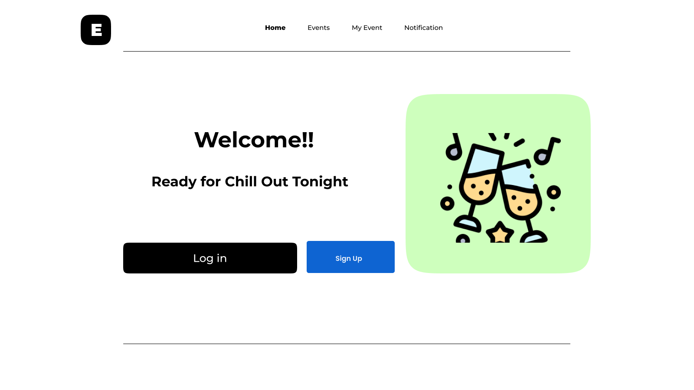
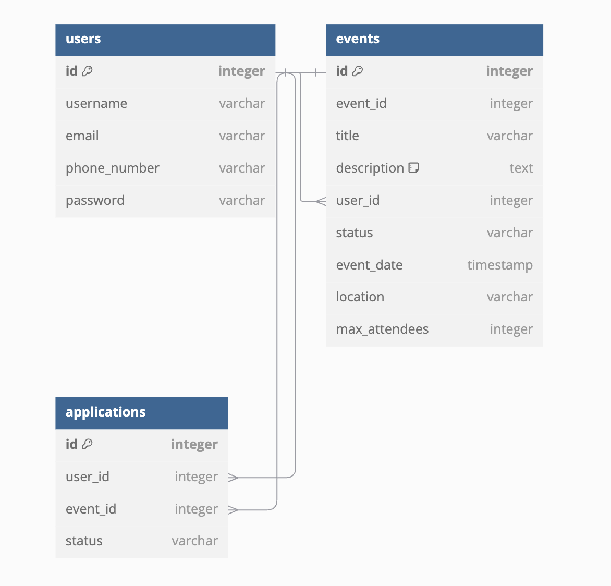

# EventLink

## Description

EventLink is a user-friendly platform that helps individuals manage and track their events. Users can create, attend, and manage events, while also interacting with other attendees through approval or rejection of participation requests. With a simple interface, EventLink ensures that users stay organized and connected with upcoming events.

## Features

1. **Home Page**

   - Provides a welcoming interface, displaying the platform theme and buttons for registration/login.
   - Includes a clear navigation bar with links to "Home," "Events," "My Event," and "Notification."
   - 

2. **Login Page**

   - Allows users to log in using their email and password.
   - Includes a "Sign Up" option for new users to create an account.

- 

3. **Create Account Page**

   - Enables users to enter their name, email, phone number, and password to create an account.
   - Provides an option to return to the login page.
   - 

4. **Event Page**

   - Lists upcoming events, each displaying the title, date/time, a brief description, and a "Register" button.
   - Features a clean design to allow users to browse and select events easily.
     - 

5. **My Event Page**

   - Lists upcoming events that I am attending and the events created by me.
   - Provides navigation to the Create Event page, allowing users to customize their own events.
   

     
     
   

6. **Notification Page**
   - Allows users to approve or reject participation requests from others.
   - Displays the status of the user's own event participation requests.
   - 

## Diagram

- 
